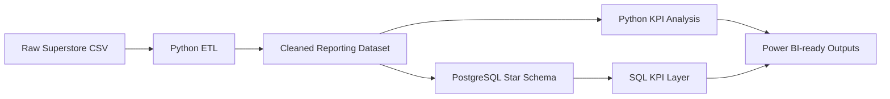
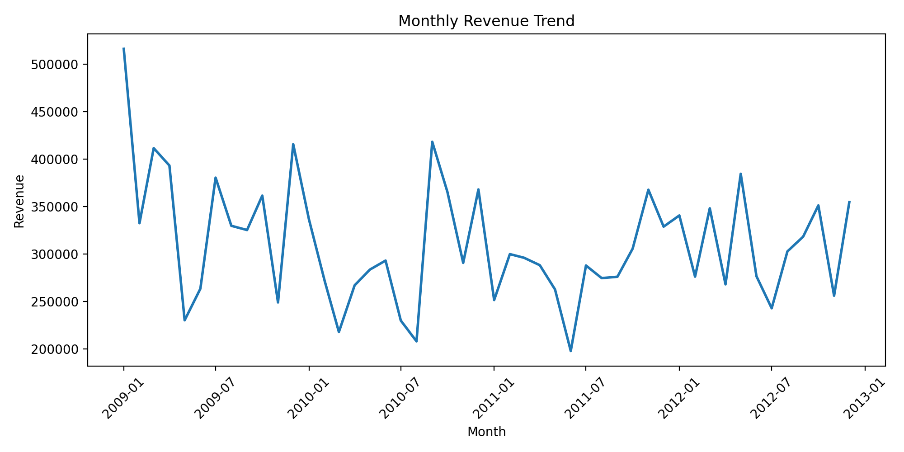
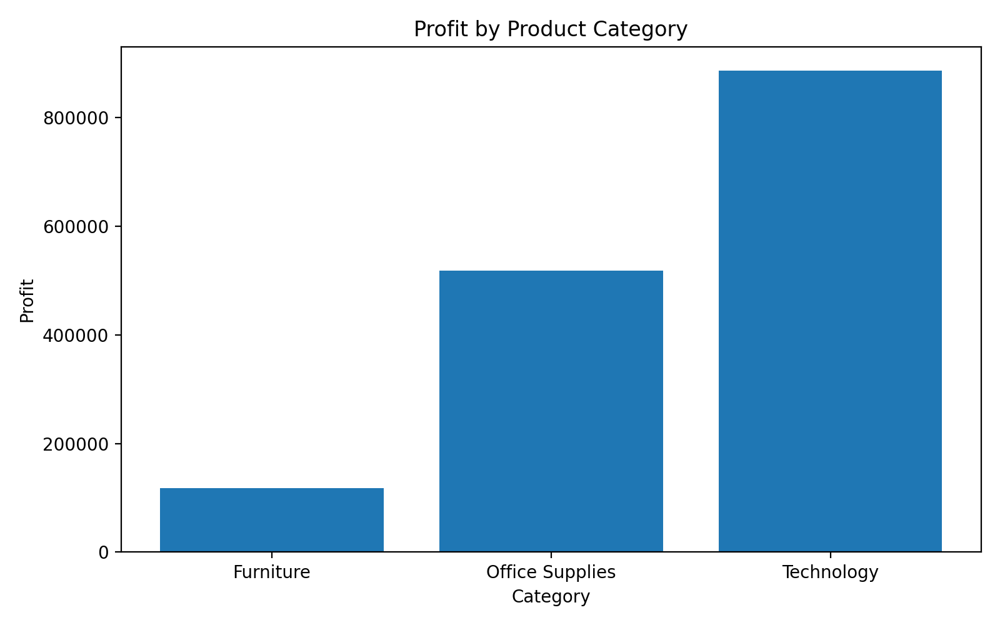

# Business KPI Dashboard & Analytics System

**End-to-end retail analytics pipeline that transforms raw transactional sales data into a reporting-ready dataset, PostgreSQL star schema, SQL KPI layer, and Power BI-ready outputs.**

Built with **Python, pandas, PostgreSQL, SQLAlchemy, SQL, pytest, matplotlib, and Power BI**.

## Project at a glance

| Area | Implementation |
|---|---|
| Source data | Superstore transactional sales dataset |
| Processing | Python ETL + validation + feature engineering |
| Data model | PostgreSQL star schema |
| Analytics | SQL KPI query pack + Python analysis |
| BI handoff | Power BI-ready CSV outputs + dashboard specification |
| Outputs | KPI, monthly, customer, product, category and regional datasets |
| Visuals | Revenue trend + category profitability charts |
| Quality | pytest |
| Database loading | SQLAlchemy + PostgreSQL |

## Business problem

Transactional sales data is useful only when teams can turn it into consistent management information.

This project builds an analytics workflow for questions such as:

- Are we growing revenue profitably?
- Which categories and products generate or destroy margin?
- Which customers drive the largest revenue pool?
- How is performance changing over time?
- Which regions are commercially strong?
- Where should management investigate pricing, discounting, or product mix?

## Architecture



The pipeline is designed so the same cleaned data can support both **SQL-based reporting** and **Power BI analysis**.

## Key business results

The current generated outputs show:

| KPI | Result |
|---|---:|
| Revenue | **$14.92M** |
| Profit | **$1.52M** |
| Profit margin | **10.2%** |
| Orders | **5,496** |
| Customers | **795** |
| Average order value | **$2,713.90** |
| Repeat customers | **784** |
| One-time customers | **11** |
| Repeat customer rate | **98.62%** |

### What the numbers suggest

**Technology is the strongest category-level profit engine.** It generated approximately **$5.98M revenue** and **$886.3K profit**, with a **14.81% margin**.

**Furniture is the clearest profitability problem.** It generated approximately **$5.18M revenue** but only **$117.4K profit**, producing a **2.27% margin**.

**Tables require particular attention.** They generated approximately **$1.90M revenue** while contributing about **-$99.1K profit**.

**March 2010 is an important profitability anomaly.** Revenue was approximately **$217.8K**, but profit was only **$1.1K**, suggesting that discounting, product mix, or cost pressure deserves investigation.

**Ontario is the strongest geography by revenue.** It generated approximately **$3.06M revenue** and **$346.9K profit** across **1,235 orders**.

These findings are derived from the repository's generated KPI outputs and are documented in `docs/business_insights.md`.

## Data engineering workflow

The main pipeline is:

```text
Raw CSV
  ↓
Column standardization
  ↓
Data type conversion
  ↓
Duplicate / invalid-record handling
  ↓
Missing-value treatment
  ↓
Surrogate dimension IDs
  ↓
Reporting features
  ↓
Cleaned dataset
  ├── KPI exports
  ├── customer summaries
  ├── product/category summaries
  ├── regional summaries
  ├── monthly trends
  └── chart assets
       ↓
PostgreSQL star schema
       ↓
SQL KPI queries
       ↓
Power BI
```

The transformation layer also engineers:

- shipment delay days
- gross margin percentage
- shipping cost ratio
- profitability flags
- order year / quarter / month
- customer order sequence
- first-order date
- order-level revenue and profit totals

## Data model

The PostgreSQL reporting layer follows a star-schema design:

```text
                 dim_customers
                       │
                       │
dim_products ─── fact_sales ─── dim_geography
```

### Dimensions

- `dim_customers`
- `dim_products`
- `dim_geography`

### Fact

- `fact_sales`

This structure keeps analytical dimensions separate from transactional measures and makes the model straightforward to consume from SQL or Power BI.

## SQL analytics

`sql/kpi_queries.sql` contains reusable queries for:

- Executive KPI summary
- Monthly revenue and month-over-month growth
- Top products
- Category/sub-category performance
- Regional performance
- Customer retention
- Low-performing products

The queries calculate both scale and profitability rather than relying only on revenue rankings.

Example business analysis pattern:

```sql
revenue
profit
profit_margin_pct
orders
customers
```

This allows a high-revenue product or category to be evaluated alongside its actual profit contribution.

## Power BI

The repository includes a dashboard specification for five report pages:

1. **Executive Overview**
2. **Sales Trends**
3. **Customer Insights**
4. **Product & Category Performance**
5. **Regional Performance**

Recommended visuals include KPI cards, revenue trends, MoM growth, category profitability, customer analysis, product rankings, and geographic comparisons.

The project currently provides **Power BI-ready outputs and a dashboard build specification rather than a committed .pbix file**.

## Generated outputs

The pipeline produces:

```text
outputs/
├── cleaned_dataset.csv
├── customer_segments.csv
├── customer_summary.csv
├── kpi_summary.csv
├── low_performing_products.csv
├── monthly_revenue.csv
├── top_categories.csv
├── top_products.csv
├── top_regions.csv
└── charts/
    ├── category_profitability.png
    └── monthly_revenue_trend.png
```

These outputs make the project useful even without a live PostgreSQL connection.

## Charts

### Monthly revenue trend



### Profit by category



## Tech stack

### Data & analytics

- Python 3.11
- pandas
- NumPy
- matplotlib
- SQL

### Database

- PostgreSQL
- SQLAlchemy
- psycopg2

### BI

- Power BI
- DAX-ready reporting structure

### Quality

- pytest
- Git

## Repository structure

```text
.
├── data/
│   ├── raw/
│   └── processed/
├── docs/
│   ├── architecture.md
│   ├── business_insights.md
│   ├── dashboard_spec.md
│   └── source_data_profile.md
├── outputs/
│   ├── KPI and analytical CSV exports
│   └── charts/
├── sql/
│   ├── kpi_queries.sql
│   └── schema.sql
├── src/
│   ├── analysis.py
│   ├── config.py
│   ├── extract.py
│   ├── load.py
│   ├── pipeline.py
│   └── transform.py
├── tests/
│   └── test_transform.py
├── requirements.txt
└── README.md
```

## Run locally

### 1. Create a virtual environment

```powershell
python -m venv .venv
.venv\\Scripts\\Activate.ps1
```

### 2. Install dependencies

```powershell
pip install -r requirements.txt
```

### 3. Run the complete pipeline

```powershell
python -m src.pipeline
```

The pipeline will:

1. Read the raw dataset.
2. Clean and transform the records.
3. Write the cleaned dataset.
4. Generate analytical CSV outputs.
5. Generate chart assets.
6. Load PostgreSQL when database credentials are configured.

### 4. Run tests

```powershell
pytest tests/test_transform.py
```

## PostgreSQL configuration

Copy `.env.example` to `.env` and configure:

```text
POSTGRES_HOST
POSTGRES_PORT
POSTGRES_DB
POSTGRES_USER
POSTGRES_PASSWORD
POSTGRES_SCHEMA
```

When credentials are available, the pipeline creates the reporting schema and loads the dimension/fact tables.

Without a configured PostgreSQL password, the CSV analytics workflow still runs.

## Portfolio value

This project demonstrates a complete analytics workflow rather than only a dashboard:

**Raw data → ETL → data modeling → SQL → KPIs → business insights → BI handoff**

It is particularly relevant to:

- Data Analyst
- BI Analyst
- Reporting Analyst
- Analytics / Data Working Student
- Junior Data Engineering roles with analytics responsibilities

### Resume-ready summary

> Built an end-to-end retail analytics pipeline in Python and SQL, transforming transactional sales data into a PostgreSQL star schema and Power BI-ready KPI datasets covering revenue, profitability, customer retention, product performance, and regional analysis.

## Limitations & next improvements

- The source dataset uses customer names rather than a native customer ID, so surrogate customer keys are generated during transformation.
- The current project exports Power BI-ready datasets rather than committing a `.pbix` file.
- PostgreSQL loading requires local credentials.
- Future iterations could add dbt, orchestration, stronger data-quality checks, Dockerized execution, and a published Power BI report.
